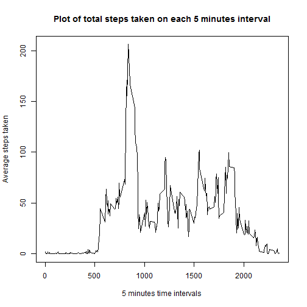
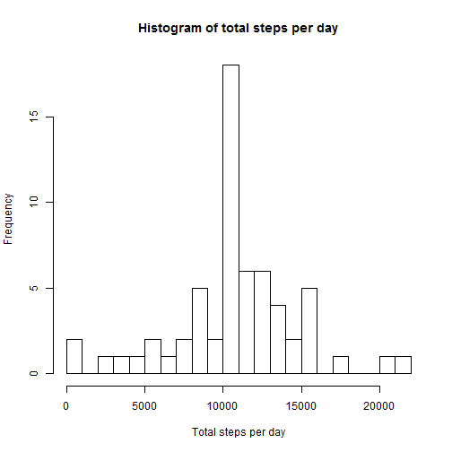
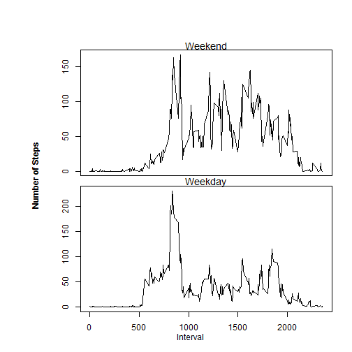

```r
---
title: "Reproducible Data Analysis"
output: html_document
---
```

```
## Error: <text>:5:0: unexpected end of input
## 3: output: html_document
## 4: ---
##   ^
```


```r
knitr::opts_chunk$set(echo = TRUE)
```

## R Markdown

This is markdown file created using knitr. 

## Loading and preprocessing the data

```r
  activity <- read.csv("activity.csv",stringsAsFactors = FALSE) # loading the data set
  no.na <- subset(activity,is.na(activity$steps)==FALSE)  #remove rows with NA values
```

## Mean total number of steps taken per day
Total number of steps averaged over all the days is calculated and the histogram plot is

```r
  total <-with(no.na,tapply(steps,date,sum)) # total number of steps per day
  steps.day <- na.omit(data.frame(Date = names(total),Steps = total)) # make a data frame
  hist(steps.day$Steps,25,main = "Histogram of total steps per day",xlab = "Total steps per day")   # histogram of total steps per day
```


======
The mean and the median of the total number of steps per day are

```r
  summary(steps.day$Steps)[c(4,3)] # mean and median calculated using summary()
```

```
##   Mean Median 
##  10770  10760
```

## Average daily activity pattern

```r
  avg.int <- with(na.omit(activity),tapply(steps,as.factor(interval),mean)) # steps per each interval averaged over all days
  d0 <- data.frame(Interval = names(avg.int), Steps = avg.int) # create a data frame to plot
```

The time series plot of 5 minutes interval and the average number of steps taken is given by


```r
plot(as.numeric(as.character(d0$Interval)),d0$Steps,type="l", main = "Plot of total steps taken on each 5 minutes interval",xlab="5 minutes time intervals",ylab= "Average steps taken") # plot of steps per interval
```



The 5 minutes interval that contains maximum number of steps is

```r
  which.max(d0$Steps) #  max steps per interval is calculated 
```

```
## 835 
## 104
```

## Imputing missing values

 The total number of missing values are calculated as

```r
sum(is.na(activity$steps)) #calculates total number of rows with NA
```

```
## [1] 2304
```


```r
  d61 <- as.data.frame(lapply(d0,rep,61)) # create a data frame of dimension of original dataset but each time interval representing the steps averaged over all days.
  suppressWarnings(for(i in 1:17568){if(is.na(activity[i,1])==TRUE){activity[i,1] <- d61[i,2]}})  # replace the missing value by average steps of the corresponding time interval.
```


```r
  total <-with(activity,tapply(steps,date,sum)) # total steps per day using new filled in dataset.
  steps.day <- data.frame(Date = names(total),Steps = total)
  hist(steps.day$Steps,25,main = "Histogram of total steps per day",xlab = "Total steps per day") #histogarm from new dataset.
```



The mean and the median of the total number of steps per day are

```r
  summary(steps.day$Steps)[c(4,3)] # mean and median from new data set
```

```
##   Mean Median 
##  10770  10770
```

## Differences in activity patterns between weekdays and weekends

Creation of new factor variable describing day of the week.

```r
Day <- weekdays(as.Date(activity$date,"%Y-%m-%d")) # create a factor variable for the day of week from the date variable of our data set
Day <- gsub("Sunday","Weekend",Day)
Day <- gsub("Saturday","Weekend",Day)
Day <- gsub("Monday","Weekday",Day)
Day <- gsub("Tuesday","Weekday",Day)
Day <- gsub("Wednesday","Weekday",Day)
Day <- gsub("Thursday","Weekday",Day)
Day <- gsub("Friday","Weekday",Day)
activity <- cbind(activity,Day)
```

The average steps taken on weekend and the weekdays are calculated as

```r
  weekend <- with(subset(activity,Day == "Weekend"),tapply(steps,interval,mean))
  weekend <- data.frame(Interval = names(weekend),Steps = weekend) # divide the data set into weekend and weekday 
  weekday <- with(subset(activity,Day == "Weekday"),tapply(steps,interval,mean))
  weekday <- data.frame(Interval = names(weekday),Steps = weekday)
```

The panel plot of average steps taken in each 5 minutes interval during weekend and weekday are


```r
  # multiple plots representing number of steps taken on each intercal in weekend and weekday
  par(mfrow=c(2,1),mar = c(0,4,1,1), oma =c(4,4,4,1),font.main = 1)
  plot(as.numeric(as.character(weekend$Interval)),weekend$Steps,type="l",main = "Weekend",xlab = "",ylab = "", xaxt='n')
  plot(as.numeric(as.character(weekday$Interval)),weekday$Steps,type="l", main ="Weekday",xlab = "",ylab = "")
  mtext("Interval", 1, 2, outer=TRUE,las =1)
  mtext("Number of Steps", 2, 0, outer=TRUE, las=0,font = 2)
```


```
```
```
```
```
```

